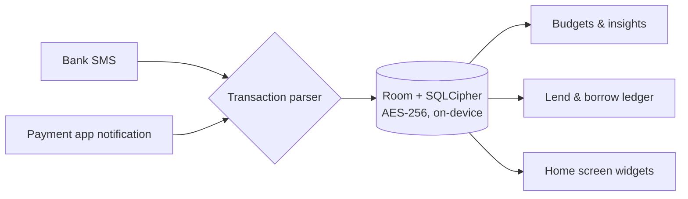

<div align="center">
  

  # Kanri

  **The offline-first personal finance ledger for Android**

  Kanri reads your bank SMS and payment notifications, keeps a running tally of every rupee that moves, and never sends any of it off your phone.

  [](https://github.com/omkarnub/Kanri/releases/latest)
  [](https://github.com/omkarnub/Kanri/releases)
  [](#installation)
  [](#privacy--security)
</div>

---

## Table of Contents

- [Overview](#overview)
- [Screenshots](#screenshots)
- [Features](#features)
- [Architecture](#architecture)
- [Tech Stack](#tech-stack)
- [Installation](#installation)
- [Building from Source](#building-from-source)
- [Privacy & Security](#privacy--security)
- [Contributing](#contributing)
- [License](#license)
- [Star History](#star-history)

## Overview

Most expense trackers stop at your own spending. Kanri also keeps a ledger of money you lend and borrow, splits shared bills, and projects your month-end balance before it happens — all from parsed SMS and notifications, with no login and no server.

Everything runs fully offline — there's no Kanri backend to breach, because there isn't one.

## Screenshots

> [!TIP]
> Add 4–6 screenshots to `docs/screenshots/` (home, insights, lend & borrow, widgets) and uncomment the block below. A real screenshot strip will sell this README harder than any badge.

<!--
<p align="center">
  
  
  
  
</p>
-->

## Features

<table>
<tr>
<td width="50%" valign="top">
 <strong>Offline by default</strong>

All records, categories, and notes are encrypted on-device with SQLCipher (AES-256) behind Android Keystore hardware keys. No analytics, no ad SDKs, no credit-score inquiries.
</td>
<td width="50%" valign="top">
 <strong>Dual-engine transaction capture</strong>

An SMS parser covers 15+ major banks; a notification listener catches Google Pay, PhonePe, Paytm, CRED, FamPay, and Amazon Pay in real time. Cross-channel fingerprinting drops the duplicates. Messaging apps are never read.
</td>
</tr>
<tr>
<td width="50%" valign="top">
 <strong>Lend & borrow ledger</strong>

Track what you're owed and what you owe, log partial repayments, split a bill across 2–20 people, and settle up with a pre-filled UPI deep link or a one-tap WhatsApp reminder.
</td>
<td width="50%" valign="top">
 <strong>Savings milestones</strong>

Set a target, see the daily and monthly pace needed to hit it, and log contributions with quick steppers (+₹500 / +₹1,000 / +₹2,000 / +₹5,000).
</td>
</tr>
<tr>
<td width="50%" valign="top">
 <strong>Insights & financial health</strong>

18+ visualizations — a GitHub-style spending heatmap, a 365-day matrix, burn-rate projections, month-over-month comparisons — plus a 0–100 health score weighing savings rate, budget use, spend velocity, and debt load.
</td>
<td width="50%" valign="top">
 <strong>Home screen & quick settings</strong>

Seven widgets (today's spend, budget ring, goals ring, lend/borrow, split bill, quick add) and a Quick Settings tile for logging an expense from anywhere. Screen-off auto-lock re-secures the app with biometrics the moment the display turns off.
</td>
</tr>
<tr>
<td width="50%" valign="top">
 <strong>A quieter aesthetic</strong>

A matte `#121212` dark palette, Panchang display type paired with Google Sans Flex, and frosted-glass surfaces via Haze.
</td>
<td width="50%" valign="top">
 <strong>Haptics that match the hardware</strong>

Calibrated feedback for linear resonant actuators on newer phones, with a soft 3–8 ms fallback on older ERM motors so it never buzzes harder than it should.
</td>
</tr>
</table>

## Architecture



## Tech Stack

| | |
|---|---|
|  | Language |
|  | UI toolkit, BOM 2026.02.01 |
|  | Local database, KSP compiler |
|  | AES-256 encryption at rest, Android Keystore, Google Tink |
|  | Background tasks |
|  | Lock screen authentication |
|  | Glassmorphism effects |
|  | 35 suites, 100% coverage of financial logic |

## Installation

Grab the latest signed APK from the [Releases page](https://github.com/omkarnub/Kanri/releases/latest).

- **Package:** `com.omkarnub.kanri`
- **Size:** ~24.9 MB (R8 minified, shrunk)
- **Requires:** Android 8.0 (API 26) or later

> [!NOTE]
> Kanri isn't on the Play Store yet, so Android will ask you to confirm installing from an unknown source the first time. That's expected for a sideloaded APK — just confirm you got it from this repo's Releases page.

## Building from Source

```bash
git clone https://github.com/omkarnub/Kanri.git
cd Kanri
```

Open the project in Android Studio (Ladybug/Meerkat or later, JDK 17 or 21), then:

```bash
./gradlew assembleDebug        # build a debug APK
./gradlew testDebugUnitTest    # run the unit test suite
```

## Privacy & Security

Kanri starts from one premise: your financial data is yours.

- **No analytics or tracking SDKs** — nothing about how you use the app leaves the app.
- **No account required** — no email, phone verification, or password.
- **No credential harvesting** — Kanri never asks for banking passwords, ATM PINs, or UPI credentials.
- **Encrypted, user-initiated backups** — local backups use AES-GCM with PBKDF2 under a passphrase you choose.

Full details: [Privacy Policy](PRIVACY_POLICY.md)

## Contributing

Issues and pull requests are welcome. For anything larger than a small fix, open an issue first so we can talk through the approach before you put the work in.

## License

See [LICENSE](LICENSE) for terms.

## Star History

[](https://star-history.com/#omkarnub/Kanri&Date)

---

<div align="center">

Built by [omkarnub](https://github.com/omkarnub)

</div>