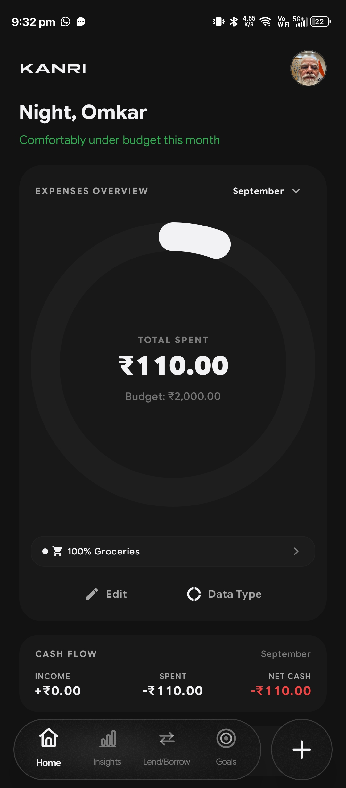
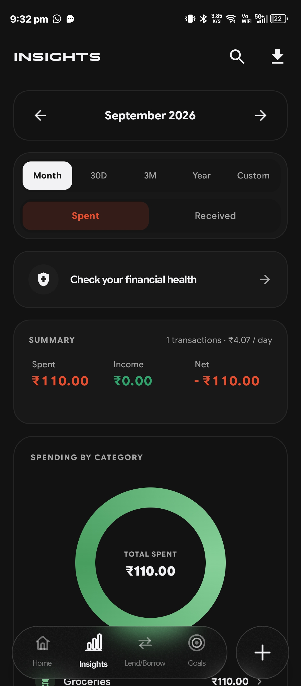
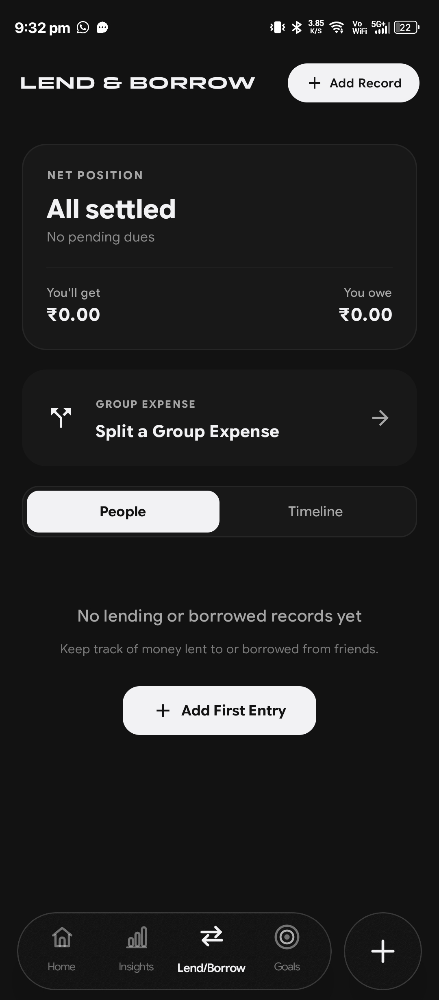
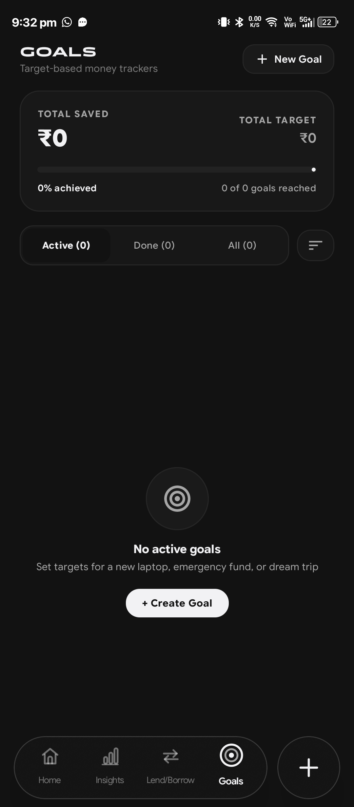
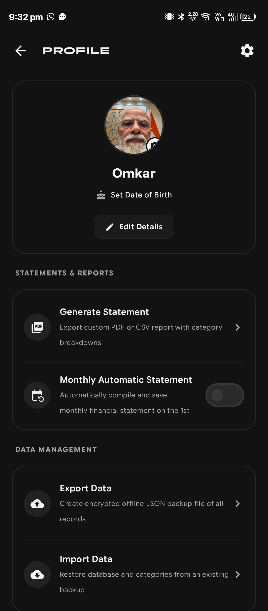
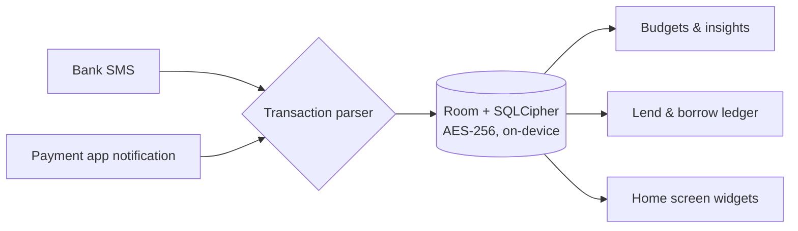

<div align="center">
  

  # Kanri

  **The offline-first personal finance ledger for Android**

  Kanri reads your bank SMS and payment notifications, keeps a running tally of every rupee that moves, and never sends any of it off your phone.

  <p align="center">
    <a href="https://rookieenough.github.io/Orion-Data/redirect.html?id=kanri" target="_blank">
      
    </a>
  </p>

  [](https://github.com/omkarnub/Kanri/releases/latest)
  [](https://github.com/omkarnub/Kanri/releases)
  [](LICENSE)
  [](#installation)
  [](#privacy--security)
</div>

---

## Table of Contents

- [Overview](#overview)
- [Screenshots](#screenshots)
- [Features](#features)
- [Architecture](#architecture)
- [Tech Stack](#tech-stack)
- [Installation](#installation)
- [Building from Source](#building-from-source)
- [Privacy & Security](#privacy--security)
- [Contributing](#contributing)
- [License](#license)
- [Star History](#star-history)

## Overview :milky_way:

Most expense trackers stop at your own spending. Kanri also keeps a ledger of money you lend and borrow, splits shared bills, and projects your month-end balance before it happens — all from parsed SMS and notifications, with no login and no server.

Everything runs fully offline — there's no Kanri backend to breach, because there isn't one.

## Screenshots :framed_picture:

<p align="center">
  
  &nbsp;&nbsp;
  
  &nbsp;&nbsp;
  
  &nbsp;&nbsp;
  
  &nbsp;&nbsp;
  
</p>

<p align="center">
  <sub>Home &nbsp;·&nbsp; Insights &nbsp;·&nbsp; Lend & Borrow &nbsp;·&nbsp; Goals &nbsp;·&nbsp; Profile</sub>
</p>

## Features :sparkles:

<p align="center">
  
</p>

<table>
  <tr>
    <td width="50%" valign="top">
      <br>
      <strong>Offline by default</strong><br>
      All records, categories, and notes are encrypted on-device with SQLCipher (AES-256) behind Android Keystore hardware keys. No analytics, no ad SDKs, no credit-score inquiries.<br><br>
      <code>SQLCipher AES-256</code> <code>Android Keystore</code> <code>Zero Trackers</code>
    </td>
    <td width="50%" valign="top">
      <br>
      <strong>Dual-engine transaction capture</strong><br>
      An SMS parser covers 15+ major banks; a notification listener catches Google Pay, PhonePe, Paytm, CRED, FamPay, and Amazon Pay in real time. Cross-channel fingerprinting drops duplicates. Messaging apps are never read.<br><br>
      <code>SMS Parser</code> <code>Notification Listener</code> <code>Smart Deduplication</code>
    </td>
  </tr>
  <tr>
    <td width="50%" valign="top">
      <br>
      <strong>Lend & borrow ledger</strong><br>
      Track what you're owed and what you owe, log partial repayments, split a bill across 2–20 people, and settle up with a pre-filled UPI deep link or a one-tap WhatsApp reminder.<br><br>
      <code>Debt & Credit Ledger</code> <code>Bill Splitting</code> <code>UPI Deep Links</code>
    </td>
    <td width="50%" valign="top">
      <br>
      <strong>Savings milestones</strong><br>
      Set a target, see the daily and monthly pace needed to hit it, and log contributions with quick steppers (+₹500 / +₹1,000 / +₹2,000 / +₹5,000).<br><br>
      <code>Goal Pacing</code> <code>Quick Steppers</code> <code>Target Milestones</code>
    </td>
  </tr>
  <tr>
    <td width="50%" valign="top">
      <br>
      <strong>Insights & financial health</strong><br>
      18+ visualizations — a GitHub-style spending heatmap, a 365-day matrix, burn-rate projections, month-over-month comparisons — plus a 0–100 health score weighing savings rate, budget use, spend velocity, and debt load.<br><br>
      <code>Heatmap & Matrix</code> <code>Burn Rate</code> <code>Health Score 0–100</code>
    </td>
    <td width="50%" valign="top">
      <br>
      <strong>Home screen & quick settings</strong><br>
      Seven widgets (today's spend, budget ring, goals ring, lend/borrow, split bill, quick add) and a Quick Settings tile for logging an expense from anywhere. Screen-off auto-lock re-secures the app with biometrics the moment the display turns off.<br><br>
      <code>7 Android Widgets</code> <code>Quick Settings Tile</code> <code>Biometric Lock</code>
    </td>
  </tr>
  <tr>
    <td width="50%" valign="top">
      <br>
      <strong>A quieter aesthetic</strong><br>
      A matte <code>#121212</code> dark palette, Panchang display type paired with Google Sans Flex, and frosted-glass surfaces via Haze.<br><br>
      <code>Matte #121212</code> <code>Panchang Typography</code> <code>Haze Glassmorphism</code>
    </td>
    <td width="50%" valign="top">
      <br>
      <strong>Haptics that match the hardware</strong><br>
      Calibrated feedback for linear resonant actuators on newer phones, with a soft 3–8 ms fallback on older ERM motors so it never buzzes harder than it should.<br><br>
      <code>LRA Actuators</code> <code>ERM Fallback</code> <code>Subtle Feedback</code>
    </td>
  </tr>
</table>

## Architecture :compass:



## Tech Stack :hammer_and_wrench:

| | |
|---|---|
|  | Language |
|  | UI toolkit, BOM 2026.02.01 |
|  | Local database, KSP compiler |
|  | AES-256 encryption at rest, Android Keystore, Google Tink |
|  | Background tasks |
|  | Lock screen authentication |
|  | Glassmorphism effects |
|  | 35 suites, 100% coverage of financial logic |

## Installation :package:

<p align="center">
  <a href="https://rookieenough.github.io/Orion-Data/redirect.html?id=kanri" target="_blank">
    
  </a>
</p>

Kanri is available directly on **Orion Store** for automated background updates and verified release delivery, or you can sideload the standalone signed APK.

### Install Options

- **[Orion Store (Recommended)](https://rookieenough.github.io/Orion-Data/redirect.html?id=kanri):** Seamless one-tap install, automatic updates, and transparent provenance tracking.
- **Direct GitHub APK:** Grab the latest signed APK from the [Releases page](https://github.com/omkarnub/Kanri/releases/latest).

- **Package:** `com.omkarnub.kanri`
- **Size:** ~24.9 MB (R8 minified, shrunk)
- **Requires:** Android 8.0 (API 26) or later

> [!NOTE]
> When installing via standalone APK download instead of Orion Store, Android may ask you to confirm installing from an unknown source the first time. That's expected for a sideloaded APK — just confirm you got it from this repository's Releases page.

## Building from Source :hammer:

```bash
git clone https://github.com/omkarnub/Kanri.git
cd Kanri
```

Open the project in Android Studio (Ladybug/Meerkat or later, JDK 17 or 21), then:

```bash
./gradlew assembleDebug        # build a debug APK
./gradlew testDebugUnitTest    # run the unit test suite
```

## Privacy & Security :shield:

Kanri starts from one premise: your financial data is yours.

- **No analytics or tracking SDKs** — nothing about how you use the app leaves the app.
- **No account required** — no email, phone verification, or password.
- **No credential harvesting** — Kanri never asks for banking passwords, ATM PINs, or UPI credentials.
- **Encrypted, user-initiated backups** — local backups use AES-GCM with PBKDF2 under a passphrase you choose.

Full details: [Privacy Policy](PRIVACY_POLICY.md)

## Contributing :handshake:

Issues and pull requests are welcome. For anything larger than a small fix, open an issue first so we can talk through the approach before you put the work in.

## License :page_facing_up:

This project is licensed under the **GNU General Public License v3.0** (GPL-3.0). See the [LICENSE](LICENSE) file for the full license text.

## Star History :star2:

<p align="center">
  <a href="https://www.star-history.com/?type=date&repos=omkarnub%2FKanri">
    <picture>
      <source media="(prefers-color-scheme: dark)" srcset="https://api.star-history.com/chart?repos=omkarnub/Kanri&type=date&theme=dark&legend=top-left" />
      <source media="(prefers-color-scheme: light)" srcset="https://api.star-history.com/chart?repos=omkarnub/Kanri&type=date&legend=top-left" />
      
    </picture>
  </a>
</p>

---

<div align="center">

Built by [omkarnub](https://github.com/omkarnub)

</div>